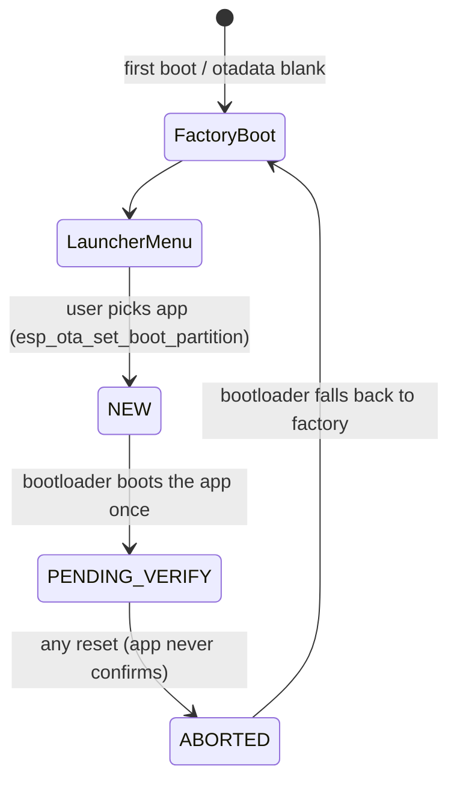

# Architecture

## Overview

Chimera-DualBoot puts three independent firmwares on one ESP32-S3 (16 MB flash):

```
                       ┌──────────────────────────────┐
   power / reset ───►  │  ROM bootloader (fixed)      │
                       └──────────────┬───────────────┘
                                      ▼
                       ┌──────────────────────────────┐
                       │  2nd-stage bootloader        │  built from Launcher/ with
                       │  (flash 0x0)                 │  app-rollback enabled
                       └──────────────┬───────────────┘
                                      ▼  reads partition table + otadata
          ┌───────────────────────────┴───────────────────────────┐
          ▼ (default)                                              ▼ (only right after a launch)
 ┌─────────────────┐                                  ┌───────────────────────┐
 │  Launcher       │   user picks an app              │  SecureVault (ota_0)  │
 │  factory slot   │ ───────────────────────────────► │  or                   │
 │  boot menu      │   sets next boot, restarts       │  ShadowTune  (ota_1)  │
 └─────────────────┘ ◄─────── next reset of any kind ─└───────────────────────┘
```

The two apps are ordinary, standalone PlatformIO firmwares. Neither contains any dual-boot code.
Everything that makes them work together lives in the **Launcher project**: the bootloader
configuration, the shared partition table and the flashing tool.

## Components

| Component | Folder | Runs from | Job |
|---|---|---|---|
| Launcher | `Launcher/` | `factory` partition | Boot menu, selects the next app, handles power-off |
| SecureVault | `SecureVault/` | `ota_0` | Hardware password manager |
| ShadowTune | `ShadowTune/` | `ota_1` | MP3 player |
| Bootloader + partition table | built by `Launcher/` | flash 0x0 / 0x8000 | Chooses what boots; **always the Launcher's** |

Because the bootloader and partition table come from the Launcher project, flashing an app
with its own `pio run -t upload` would replace them with the app's single-app layout and break
the dual boot. That is why all flashing goes through `build_all.py` / `flash_all.py`.

## How "menu on every boot" works

Goal: the Launcher menu must appear after every power-up, wake-up, crash and restart, with no
changes to either app.

The trick is the ESP-IDF bootloader's **app rollback** feature:

1. The Launcher is built with `CONFIG_BOOTLOADER_APP_ROLLBACK_ENABLE=y`.
2. When you pick an app, the Launcher calls `esp_ota_set_boot_partition(app)`. With rollback
   enabled, that boot entry is stored in state **NEW**.
3. On the next boot the bootloader runs the app and flips its state to **PENDING_VERIFY**.
4. An app that works is normally expected to confirm itself
   (`esp_ota_mark_app_valid_cancel_rollback()`). **Neither app does**, because both are built
   without rollback support.
5. So on the **next reset of any kind**, the bootloader sees an unconfirmed app, marks it
   **ABORTED**, and falls back to the factory partition, which is the Launcher.



The only requirement on the apps: **do not enable app rollback** and do not call
`esp_ota_mark_app_valid_cancel_rollback()`. Both current sdkconfigs have it disabled.
See [DEVELOPMENT.md](DEVELOPMENT.md).

## Shared resources

Both apps run on the same board, one at a time. These resources are shared by design:

| Resource | Shared how | Notes |
|---|---|---|
| `nvs` partition | Same partition, different NVS namespaces | Launcher stores its last selection in namespace `launcher`; ShadowTune stores a power-off flag in `st_power`. SecureVault's duress wipe erases the whole NVS. |
| `littlefs` partition | One partition, both apps mount it | Moved to a new offset, formatted on first mount by each app. File names do not collide. |
| `gpio_cfg` partition | Used by ShadowTune only | Optional GPIO override block. Empty means defaults. |
| SD card (SPI) | Only one app is ever running | The Launcher does not touch it. |
| I2C bus (RTC, MPU, INA219, EEPROM) | Only one app is ever running | The Launcher never touches I2C. RTC/EEPROM data is never reset by flashing. |
| Display + touch controller | Only one app is ever running | The Launcher re-initialises the display on each boot. |

Apps find `nvs`, `littlefs` and `gpio_cfg` by **type and label at runtime**, never by fixed
offset, which is what allows them to run from the shared layout unchanged.

## Launcher internals

```
Launcher/src/
├── main.cpp          Menu UI (two cards), launch flow, power-off
├── boot_manager.cpp  Finds ota_0/ota_1, checks for a valid image, selects next boot
├── display.cpp       ILI9341 (hardware SPI) + XPT2046 (bit-banged) driver
└── input.cpp         Joystick ladder + touch screen + touch pad, merged into events
```

- **Launch flow:** `inspect()` looks up the OTA partition, checks the image magic byte `0xE9`
  and reads the app descriptor (build date shown on the card). `selectNextBoot()` calls
  `esp_ota_set_boot_partition()`, which validates the whole image before writing otadata.
  A card for an empty or invalid slot shows NOT INSTALLED and cannot be launched.
- **Input safety:** nothing is reported until the inputs have been seen released for 300 ms
  after boot, so the OK press that woke the board never launches an app by accident.
- **Power-off:** triple-tap on the touch pad (3 taps within 1.5 s) blanks the display and
  enters deep sleep. Wake source is the joystick OK button (GPIO 6 going LOW).
- **Last selection:** remembered in NVS (`launcher` / `last`) and used to pre-select a card.

## Design decisions

| Decision | Why | Alternative considered |
|---|---|---|
| OTA slots + rollback fallback | Needs no change in either app; works for power cycles, crashes and wake-ups alike | A custom bootloader hook (invasive in PlatformIO dual-framework builds) |
| Launcher in the `factory` slot | Blank or aborted otadata falls back to factory automatically | Launcher in an OTA slot (needs an extra "confirmed" entry to return to it) |
| Fixed slot sizes equal to the old app partitions (4 MB / 2 MB) | Guarantees the apps still fit | Smaller slots (saves flash, risks overflow) |
| Apps keep using `nvs` / `littlefs` by label | Zero code change in the apps | Per-app partitions (would need app edits) |
| Separate flash tool instead of `pio upload` in the apps | The shared bootloader/partition table must not be overwritten | Making each app project carry the shared table (duplicated config) |

## Limits

- SecureVault image must fit in 4 MB, ShadowTune in 2 MB, Launcher in 1.25 MB.
- Only two apps are shown in the menu. Adding a third needs a new slot and UI changes (see
  [DEVELOPMENT.md](DEVELOPMENT.md)).
- Wake from deep sleep always goes through the Launcher menu; an app cannot resume directly.
