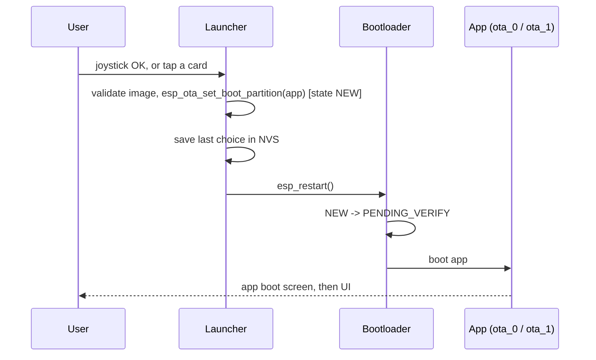
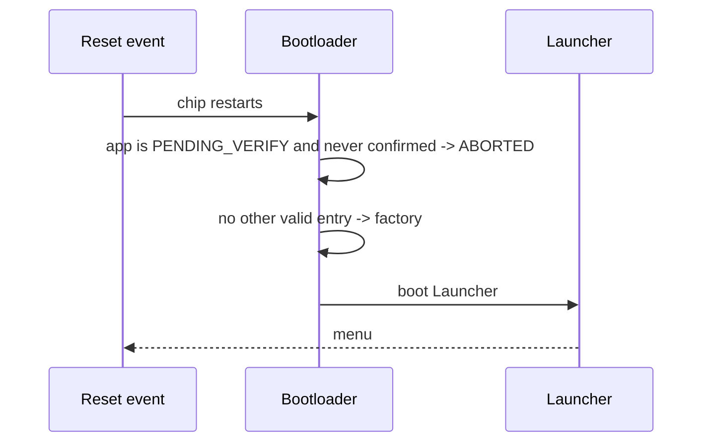

# Boot flow

All the ways the board can start, and what you see. "Menu" means the Launcher boot menu.

## 1. Cold power-up (or first flash)

```mermaid
sequenceDiagram
    participant HW as Power / reset
    participant BL as Bootloader
    participant L as Launcher (factory)
    HW->>BL: start
    BL->>BL: read partition table + otadata
    Note over BL: otadata blank or no valid entry -> factory
    BL->>L: boot factory app
    L->>L: init display, input; inspect ota_0 / ota_1
    L-->>HW: menu on screen
```

`flash_all.py` erases `otadata` when flashing, so the first boot after flashing always shows the menu.

## 2. Picking an app



If the image is missing or invalid, the card shows NOT INSTALLED (before launching) or
LAUNCH FAILED (if validation fails while launching) and you stay in the menu.

## 3. Any reset while an app is running

Power cycle, crash, watchdog, `esp_restart()`, or a wake from deep sleep:



This is why the menu appears every time, with no help from the apps.

## 4. Power off and on

| Where | Power off | What happens | Power on |
|---|---|---|---|
| Launcher | Triple-tap touch pad | Screen blanks, deep sleep | Click joystick OK, menu appears directly |
| ShadowTune | Hold touch pad 5 s | Countdown screen, then deep sleep | Click OK, menu appears, pick ShadowTune, RESUMING screen |
| SecureVault | Hold touch pad 5 s | Network modes torn down, PIN cleared, deep sleep | Click OK, menu appears, pick SecureVault |

Wake source in all three is the joystick OK button: GPIO 6 pulled LOW (`ext0` wake). The ladder
idles HIGH, so waking on HIGH would wake the chip immediately after it slept.

### Why ShadowTune uses a flag for its RESUMING screen

On a normal deep-sleep wake an app can read the hardware wake cause. Behind the Launcher the wake
goes Launcher first, and the Launcher restarts the chip to start the app, which erases the wake
cause. So ShadowTune writes `slept = true` to NVS (`st_power`) just before sleeping. On its next
start it reads and clears the flag and shows RESUMING instead of the boot animation. If you flip
the physical power switch after a power-off, the flag is still set, so that start also shows
RESUMING.

SecureVault does not do this yet, so after a power-off it shows its boot animation, not its
RESUMING screen.

## 5. Failure cases

| Situation | Result |
|---|---|
| App image corrupted | `esp_ota_set_boot_partition` fails validation, LAUNCH FAILED, back to menu |
| App crashes on start | Next reset falls back to the Launcher |
| Slot empty | Card shows NOT INSTALLED |
| otadata corrupted | Bootloader treats it as invalid and boots factory |
| Launcher itself broken | Reflash it: `python build_all.py --only Launcher --flash COM5` |
