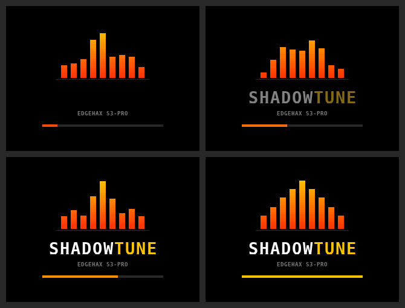
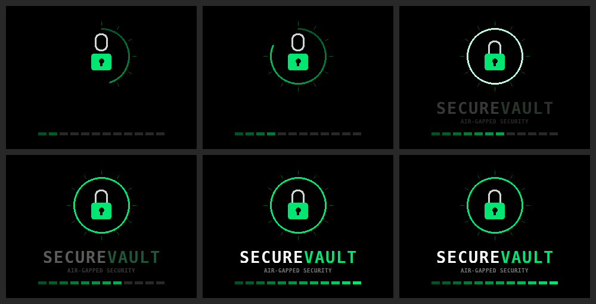

# Boot screens

The Launcher has none (it shows the menu directly). Each app has its own animated boot screen,
about 2.2 seconds long. All drawing uses plain Adafruit GFX primitives on a 320 x 240 black
background; no images are stored in flash.

> The previews below were rendered by a software simulator from the real drawing code, not
> photographed on a board. Real colours and timing on the ILI9341 may look slightly different.

## ShadowTune: equalizer

Nine animated bars (red-orange at the base, amber at the tips) dance, then settle into a symmetric
logo shape. The SHADOWTUNE wordmark fades in (SHADOW white, TUNE amber) and a loading bar fills.

- Code: `drawBootSplash()` in `ShadowTune/src/main.cpp`
- Colours: `SPLASH_ACCENT_LO` (red-orange) and `SPLASH_ACCENT_HI` (amber)
- Timing: 40 frames x 55 ms, then 150 ms hold

## SecureVault: vault door

A ring sweeps around like a vault door with bolt ticks, a padlock appears open and its shackle
drops shut, the ring flashes on the "click", SECUREVAULT fades in (SECURE white, VAULT green),
and a 12-segment bolt bar fills.

- Code: `DisplayManager::showBootSplash()` in `SecureVault/src/display_manager.cpp`
- Colours: `SPLASH_ACCENT` (emerald green) and `SPLASH_ACCENT_DIM`
- Timing: 44 frames x 50 ms, then 200 ms hold

## Changing colours

Edit the two accent constants at the top of the function and rebuild that app. Colours are
`splashRgb(r, g, b)` with 0-255 values, converted to RGB565.

## When each screen appears

- A normal start of the app shows the boot animation.
- ShadowTune shows its RESUMING screen instead when it starts after a power-off.
- SecureVault currently shows the boot animation after a power-off (its RESUMING screen only
  appears when the chip wakes straight into SecureVault, which the Launcher prevents).
